# Developer guide: Building and flashing the Smartcitizen Kit firmware.

The data board of your Smartcitizen Kit is runned by **two microcontrolers**:

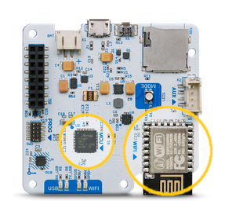


The main one is an **Atmel SAMD21**, this chip is in charge of all the normal tasks like reading the sensors, saving data, interacting with the user, etc. For this chip we need two software components the bootloader and the main firmware.

For communications the SCK has an **ESP8266 microcontroler with Wifi capabilities**, this chip receives instructions from the SAMD21 via serial port and takes care of publishing the collected data through the network. This chip needs a main firmware and a filesystem that stores the web pages for the [setup mode](http://placeholder_for_setup_mode_page) server.

## Development enviroment

The Smartcitizen Kit Firmware is on our [repository on github](https://github.com/fablabbcn/smartcitizen-kit-20) so you will need [git](https://mirrors.edge.kernel.org/pub/software/scm/git/) software [installed](https://git-scm.com/book/en/v2/Getting-Started-Installing-Git).

To build the Smartcitizen Kit firmware you need a linux computer with [platformio](https://platformio.org/) installed, you don't need the full IDE installation (Atom). You can follow [this instructions](http://docs.platformio.org/en/latest/installation.html#super-quick-mac-linux) to install only the console version.

For bootloader upload you also need [OpenOCD](http://openocd.org/) somewhere in your PATH. You can use platformIO provided binary, normally it is located in `~/.platformio/packages/tool-openocd`.


## Getting the firmware

To get the firmware just run:
```
git clone --recursive https://github.com/fablabbcn/smartcitizen-kit-20
```

The bootloader repository is a [submodule](https://git-scm.com/book/en/v2/Git-Tools-Submodules) of the main firmware so you must do a `--recursive` clone to get it.

I you download manually (with the _clone or download_ button on github) you will **not** get the bootloader code, but you can get it from [here](https://github.com/fablabbcn/uf2-samdx1/tree/88aa54c1afab2647904aaccbe1a6b960c02fdb24).


## SAMD21 bootloader

If your kit doesn't have the bootloader already flashed (all the kits that we ship come with it) you will need an [ATMEL-ICE](https://www.digikey.es/en/product-highlight/a/atmel/atmel-ice-programmer-debugger) programmer. This process can also be done with a Raspberry Pi computer and the proper [connector](https://www.adafruit.com/product/2094) and cables, we are preparing the documentation for this process.

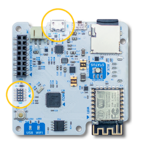

Connect the Atmel-ICE programmer to the 10 pin SWD connector and to your computer. Power the SCK via USB, you can use any USB charger or even your computer.

Open a terminal, go to the folder where you cloned the firmware repository and run:

```
cd smartcitizen-kit-20
./build.sh boot
```

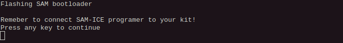

If you have everything connected click any key to continue, you will see a lot of output when compiling, the led on the SCK should _breath_ in **green** and you should see an output similar to this:

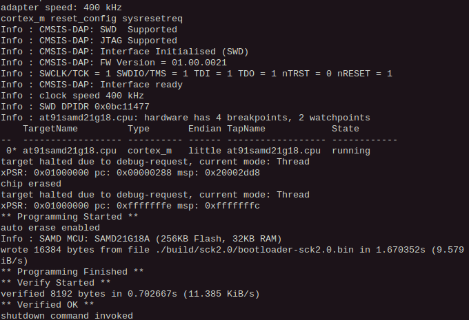

You are ready for the next step, just remember to disconnect the Atmel-ICE programmer and connect the SCK to your computer with a USB cable.
 
## SAMD21 firmware
 
The bootloader we just flashed allows a very simple way of uploading the SCK firmware based on the [UF2](https://github.com/Microsoft/uf2) format, when you **double-click the reset button** of your kit it will expose a [MSD](https://en.wikipedia.org/wiki/USB_mass_storage_device_class) interface to your computer and a new drive will popup where you can just drag the compiled firmware file (converted to UF2 format).

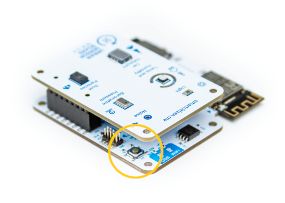

### Build script
You can use the same script used to flash the bootloader (`build.sh`) that will do everything for you: compile the firmware, convert the binary to UF2 format and upload it to the kit:

```
./build.sh sam
```

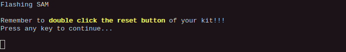

If you haven't already, **double-click the reset button of your kit** an click any key.
If this is your first time building the software, platformio will take a while installing all the needed dependencies, be patient. If there are no errors you should see an output similar to this:

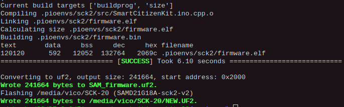

The script will leave a copy of the compiled software in UF2 format called _SAM_firmware.uf2_ you can use this file to reflash your kit without compiling it again.

### Manual install

If you want to install the firmware manually (or you had some problem with the build script) just follow this steps:

```
cd sam
pio run
```

At the end you should see some output similar to this:

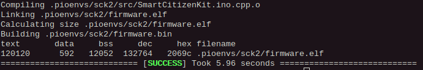

then do:

```
cd ..
tools/uf2conv.py -o SAM_firmware.uf2 sam/.pioenvs/sck2/firmware.bin
```

you should see:

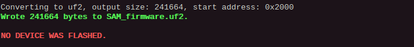

don't worry about the _NO DEVICE WAS FLASHED_ message, we are doing it manually.
Now **double-click the reset button of your kit** open your favorite file browser and drag the file you just created to the _SCK-2.0_ drive. The kit will reset and run the new firmware.

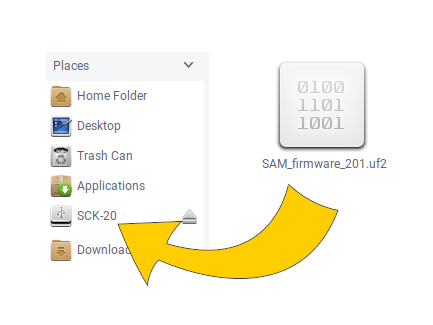


Keep in mind that if your computer is not configured to automount new drives you will need to mount your sck manually ([as any other USB drive](https://linuxconfig.org/howto-mount-usb-drive-in-linux)).


## ESP8266 firmware

Just like the other parts of the process this is also covered by our `build.sh` script. So you can just do:

```
./build.sh esp
```
As before, if this is the first time you do it, it will take a while on downloading dependecies and building the firmware.

In this case the upload process is different, since the ESP8266 chip is not connected to the USB interface the data must be uploadded through the SAMD21 chip.
Our [upload script](https://github.com/fablabbcn/smartcitizen-kit-20/blob/master/esp/uploadESP.py) takes care of searching for a SCK on the USB bus, sending a command to the kit so it put's himself in what we call _bridge mode_ (white led) and uploading the firmware. This is the expected output:

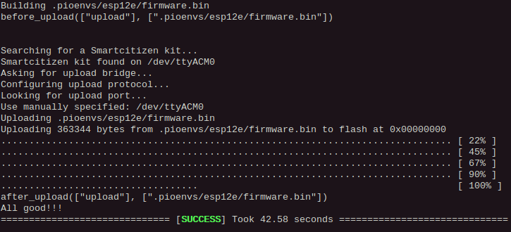


Sometimes the ESP8266 and the uploader software don't get synced and the upload fails. Normally if you try again it will work.


## ESP8266 filesystem

This process is very similar to the previous one you just need to add the letters _fs_, and wait a little longer ;)

```
./build.sh espfs
```
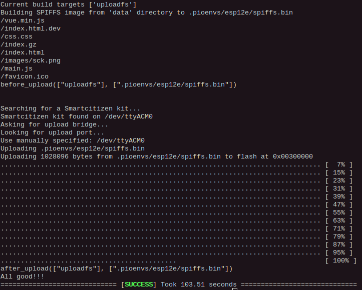

**that's all!**

###### tags: `guides` `devdocs` `docs`
*[SCK]: Smartcitizen Kit
*[SWD]: Serial Wire Debug
*[MSD]: Massive Storage Device
