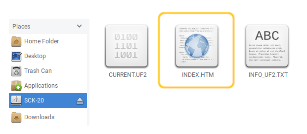
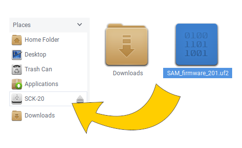

# Updating the Smartcitizen Kit 2.0

When new features are developed or bugs are fixed we will release new versions of the SCK firmware. updating your kit is very simple:

1. **Connect your kit** with a micro USB cable to your computer.

2. **Double click the reset button** of your SCK, the SCK led should turn green and a new drive called _SCK-20_ should appear on your computer file browser.

3. Inside the _SCK-20_ drive you should see some files, **double click the _INDEX.HTM_** file and our  [github releases page](https://github.com/fablabbcn/smartcitizen-kit-20/releases/latest) will open in your browser. **Download the new firmware** called _SAM_firmware_XXX.uf2_ and save it to your computer.

:::info
You can backup your current firmware version just saving the file called _CURRENT.UF2_.
:::

4. Simply **drag the firmware file you downloaded over the _SCK-20_ drive**, your kit led will blink in green and after some seconds it will reset and start with the new version.

5. **WIP ESP FLASH**

###### tags: `guides` `docs`
*[SCK]: Smartcitizen Kit
